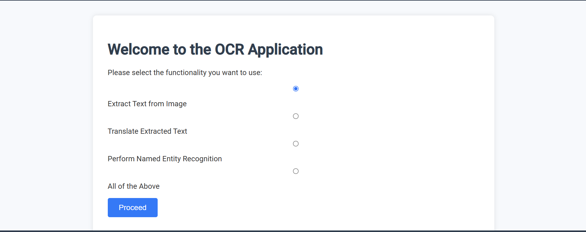
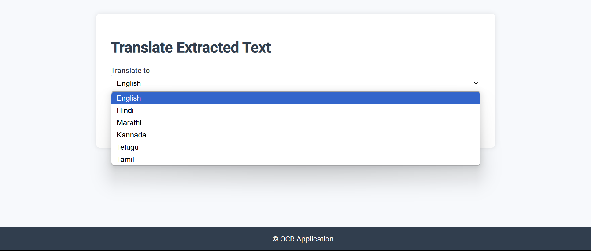
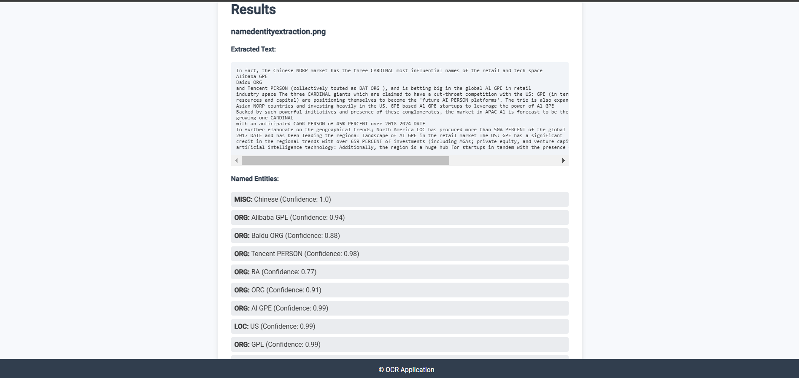

## TextStream: Image-to-Text Extraction, NER, and Multilingual Translation

Welcome to **TextStream**, an advanced web application that extracts text from images, performs Named Entity Recognition (NER), and translates text into multiple Indian languages (Hindi, Marathi, Kannada, Telugu, Tamil).

### Features

* **Optical Character Recognition (OCR)**: Uses **EasyOCR**, a deep learning-based OCR library, to accurately extract text from images, even those with complex fonts or noisy backgrounds.
* **Named Entity Recognition (NER)**: Implements **Hugging Face Transformers (XLM-RoBERTa)** to identify and classify named entities, including people, organizations, and locations, from extracted text.
* **Multilingual Translation**: Utilizes the **Google Cloud Translation API** to translate extracted text into supported Indian languages, allowing for easy understanding and accessibility.
* **User-Friendly Web Interface**: Built using **Flask**, providing an easy-to-use web interface for uploading images, selecting options, and viewing results.
* **Scalable and Modular Design**: Employs **Flask Blueprints** for modular code organization and **Docker** for consistent, containerized deployment across environments.

### Technologies Used

* **Flask**: Web framework used for creating the web interface and routing.
* **EasyOCR**: Used for Optical Character Recognition, providing robust extraction capabilities.
* **Hugging Face Transformers (XLM-RoBERTa)**: For NER to accurately identify entities across multiple languages.
* **Google Cloud Translation API**: For multilingual text translation into Indian languages.
* **PyTorch**: Provides support for deep learning models used in OCR and NER.
* **OpenCV**: For preprocessing images to improve OCR accuracy.
* **Docker**: Used for containerizing the application to ensure consistency across development, testing, and production environments.

### Workflow Description

* **Image Upload**: Users can upload one or more images to the application, which are stored in the `uploads/` directory.
* **Text Extraction (OCR)**: Once the images are uploaded, the EasyOCR model is used to extract text with high accuracy, handling complex fonts, handwriting, and multi-language content effectively.
* **Named Entity Recognition (NER)**: The extracted text is then analyzed using Hugging Face's XLM-RoBERTa model to identify named entities such as persons, locations, and organizations, which can help to extract structured information from unstructured text.
* **Translation**: Users have the option to translate the extracted text into different Indian languages. This is handled by Google Cloud Translation API, providing a reliable translation service that works seamlessly with Indian languages.

### Key Design Considerations

* **Scalable Design**: The application uses Flask Blueprints to keep the code modular and easy to scale. This modularity makes adding new features and managing existing ones straightforward.
* **Docker for Deployment**: By using Docker, we ensure the application runs in a consistent environment, making it easier to deploy across different systems without worrying about dependencies or configurations.
* **Error Handling**: Comprehensive error handling is in place across all modules (OCR, NER, Translation) to gracefully handle issues such as failed image uploads, OCR inaccuracies, translation API errors, etc. Proper user feedback is provided through messages in the user interface.

### Project Structure Overview

* **app.py**: Main entry point for the Flask application. Manages application startup and initializes configurations.
* **config.py**: Holds configuration settings, including secret keys, upload folder paths, and API credentials.
* **requirements.txt**: Lists all the dependencies required to set up and run the project.
* **Dockerfile**: Instructions to build a Docker image for containerizing the application.
* **utils/**: Contains utility scripts for various core functionalities:
  * **ocr_utils.py**: Manages OCR operations using EasyOCR for high-accuracy text extraction.
  * **nlp_utils.py**: Handles Named Entity Recognition using pre-trained Hugging Face models.
  * **translation_utils.py**: Supports text translation through Google Cloud Translation API.
* **routes/**: Defines routes that handle different aspects of the application, organized for modularity:
  * **main_routes.py**: Manages the home page, form submissions, and results display.
  * **extract_routes.py**: Handles image upload and text extraction processes.
  * **translate_routes.py**: Handles translation requests after text extraction.
  * **ner_routes.py**: Handles Named Entity Recognition on extracted text.
* **forms/**: Defines input forms using WTForms, enabling easy integration with Flask to capture user inputs effectively.
* **templates/**: HTML templates for rendering different pages, providing a consistent and easy-to-use interface for users.
* **static/**: Contains static files like CSS, JavaScript, and images to style and enhance the user interface.
* **uploads/**: Stores user-uploaded images temporarily for processing by OCR and NER modules.

### Results

